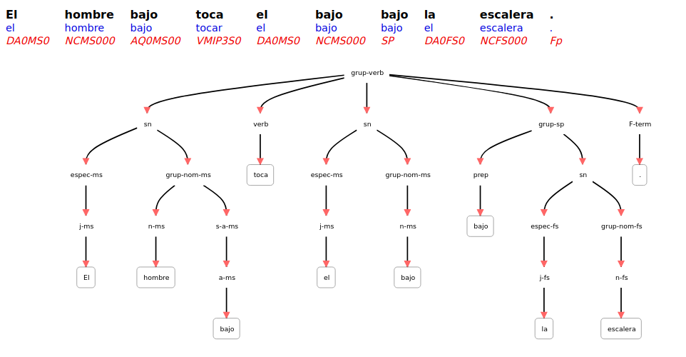
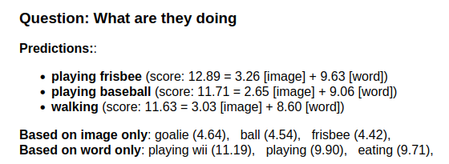
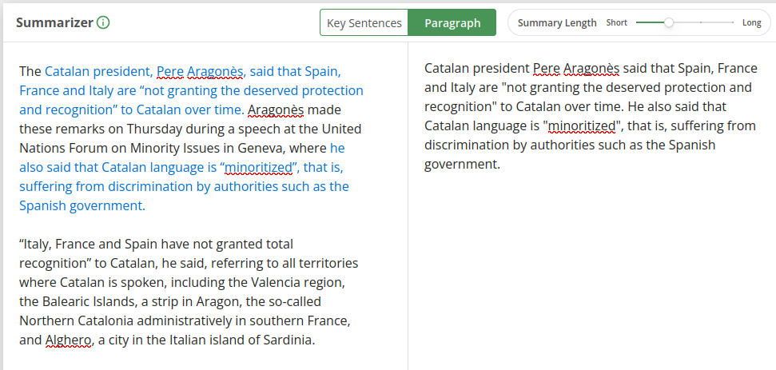
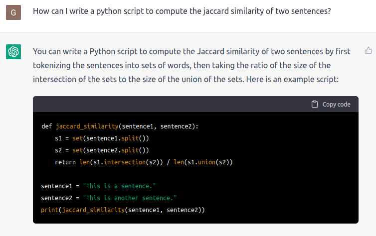
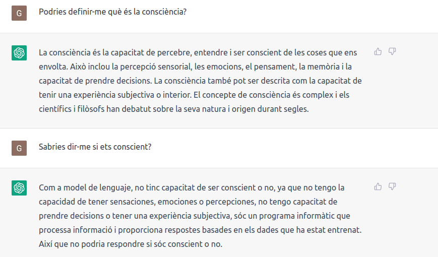

class: center, middle

## Processament del Llenguatge Humà

# Lab.1: presentació

<br>

### Gerard Escudero

## Grau en Intel·ligència Artificial

<br>


---
class: left, middle, inverse

# Sumari

- .cyan[Presentació]

- Recursos lingüístics

- Demostracions

- Exercici

---

# Objectius

* Ús de les tècniques bàsiques del processament de la llengua

* Resoldre problemes petits i mitjans d'informació textual

.cols5050[
.col1[
#### Eines

  - [Google Colab](https://colab.research.google.com) <br> codi i documentació

  - [Google Drive](https://drive.google.com) <br> dades i models

]
.col2[
#### Components:

  - Jupyter 

  - Python3

  - nltk, spaCy i Freeling
]]

---

# Avaluació

- Exercicis: pes 20% 

  - Training Hidden Markov Models
  - WordNet Similarities
  - ...

- Pràctiques: pes 30%

  - Identificació de la llengua
  - Sentiment polarity & opinion detection
  - Entrenar un model per *Name Entities*
  - Chatbot

**Items d'avaluació**:

- Eficacia
- Eficiència
- Claredat i organització
- Recursos linguistics
- Anàlisi dels resultats

---
class: left, middle, inverse

# Sumari

- .brown[Presentació]

- .cyan[Recursos lingüístics]

- Demostracions

- Exercici

---

# Natural Language Toolkit

.small[- Llibreria python open-source: [https://www.nltk.org/](https://www.nltk.org/)]

.cols5050[
.col1[
**Exemple:**

.small[
```python3
!pip install svgling
import nltk
import svgling
nltk.download('punkt')
nltk.download('averaged_perceptron_tagger')
nltk.download('maxent_ne_chunker')
nltk.download('words')
s = 'Mark is working at Google.'
x = nltk.pos_tag(nltk.word_tokenize(s))
t = nltk.ne_chunk(x)
svgling.draw_tree(t)
```
]
.center[]
]
.col2[
**Contingut:**

* *Corpus*: Brown corpus (PoS), sentence polarity corpus... 

* *recursos lèxics*: WordNet, SentiWordNet...

* *Gramàtiques*: English, Spanish, ...

* *Models*: Named Entities, taggers...
]]

---

# FreeLing

.small[
- Llibreria C++: [https://nlp.lsi.upc.edu/freeling/](https://nlp.lsi.upc.edu/freeling/)

- Conté una API per connectar via http, [TextServer](https://textserver.lsi.upc.edu/textserver/login).
]

[Demo](https://nlp.lsi.upc.edu/freeling/demo/demo.php):



---

# spaCy

- Llibreria amb model neuronal per python: [https://spacy.io/](https://spacy.io/)

**Exemple:**

```
[('Smith', 'NNP', 'nsubj', jumps),
 ('jumps', 'VBZ', 'ROOT', jumps),
 ('over', 'IN', 'prep', jumps),
 ('the', 'DT', 'det', dog),
 ('lazy', 'JJ', 'amod', dog),
 ('dog', 'NN', 'pobj', over),
 ('.', '.', 'punct', jumps)]
```


---
class: left, middle, inverse

# Sumari

- .brown[Presentació]

- .brown[Recursos lingüístics]

- .cyan[Demostracions]

- Exercici

---

# Traducció automàtica

- https://www.softcatala.org/traductor/ <br><br>


- https://translate.google.com <br><br>


---

# *Question Answering*

.cols5050[
.col1[
Q&A Demo: <br>[https://www.tomko.org/demo/](https://www.tomko.org/demo/)

<br>
<br>
<br><br>

]
.col2[
Visual Q&A Demo: [http://visualqa.csail.mit.edu/](http://visualqa.csail.mit.edu/)

<br><br>

]]

---

# Resum automàtic

QuillBot Summarizer:
[https://quillbot.com/summarize](https://quillbot.com/summarize)



Font del text: [Vilaweb](https://www.vilaweb.cat/noticies/pere-aragones-at-un-spain-doesnt-protect-catalan-language/)

---

# Imatges i llenguatge natural

.cols5050[
.col1[
**Dall-e 2**:

[https://openai.com/dall-e-2/](https://openai.com/dall-e-2/)

**Example**:

`An astronaut riding a horse in a photorealistic style`

.center[]
]
.col2[
**Stable Difusion**: open-source

[https://stablediffusionweb.com/](https://stablediffusionweb.com/)

.center[]
]]

---

# ChatGPT I

Xat de OpenAI: [https://openai.com/blog/chatgpt/](https://openai.com/blog/chatgpt/)

Exemple:



---

# ChatGPT II

Exemple:




---
class: left, middle, inverse

# Sumari

- .brown[Presentació]

- .brown[Recursos lingüístics]

- .brown[Demostracions]

- .cyan[Exercici]

---

# Exercici 1

Avaluació d'una de les demos:

1. Escolliu una de les demos de la secció anterior

2. Feu unes quantes probes amb la mateixa

3. Documenteu les probes i analitzeu els resultats

4. Feu un petit informe i lliureu-lo en format pdf al [raco](https://raco.fib.upc.edu/)

