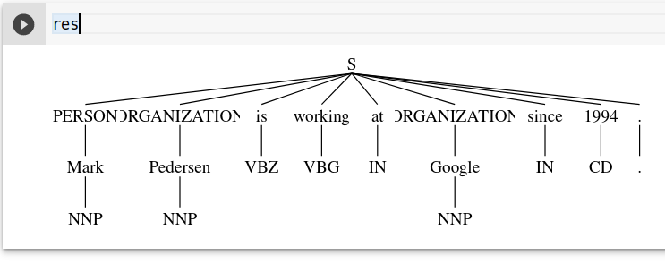
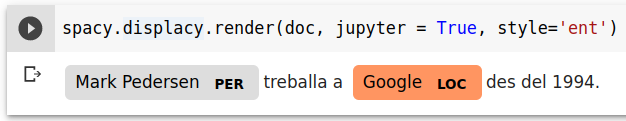
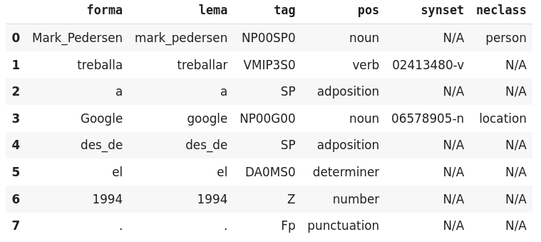
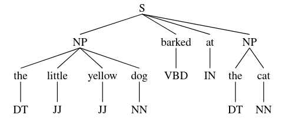
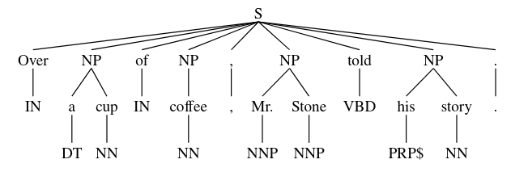
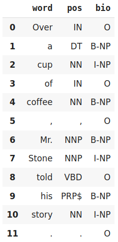

class: center, middle

## Processament del Llenguatge Humà

# Lab. 7: Seqüències de Paraules

### Gerard Escudero, Salvador Medina i Jordi Turmo

## Grau en Intel·ligència Artificial


<br>


---
class: left, middle, inverse

# Sumari

- .cyan[Documentació]

  - .cyan[Models d'Entitats Anomenades]

  - *Parsing* amb expressions regulars

  - Aprenent seqüències

- Pràctica 3: Extracció d'Informació

---

# NER (II)


---

# Entitats Anomenades amb NLTK I

- Fa servir un model de màxima entropia per defecte
- Aprés amb Connl: PERSON, LOCATION, ORGANIZATION
- Només reconeixen entitats a un nivell (no subsumcions)

**Requeriments**:

```python3
import nltk
nltk.download('punkt') # Tokenitzador
nltk.download('averaged_perceptron_tagger') # Etiquetador POS
nltk.download('maxent_ne_chunker') # Etiquetador Entitats Anomenades
nltk.download('words')
```

**Ús**:

```python3
sentence = "Mark Pedersen is working at Google since 1994."

res = nltk.ne_chunk(
        nltk.pos_tag(
          nltk.word_tokenize(sentence)))

type(res)  👉  nltk.tree.tree.Tree
```

---

# Entitats nominals amb NLTK II

**Resultat**:

.cols5050[
.col1[
```python3
print(res)
👉  (S
      (PERSON Mark/NNP)
      (ORGANIZATION Pedersen/NNP)
      is/VBZ
      working/VBG
      at/IN
      (ORGANIZATION Google/NNP)
      since/IN
      1994/CD
      ./.)
```
]
.col2[
```python3
!pip install svgling
import svgling
```


]]

---

# Entitats nominals amb spaCy I

* Deep Convolutional Neural Network
* Word Embeddings (Ho estudiarem més endavant)
* Aprés amb Ontonotes: CARDINAL, DATE, EVENT, ... (i 15 més)

**Requeriments**:

```python3
!python -m spacy download ca_core_news_sm
import spacy
nlp = spacy.load("ca_core_news_sm")
```

**Ús**:

```python3
sentence = "Mark Pedersen treballa a Google des del 1994."
doc = nlp(sentence)

[(token.text, token.pos_, token.tag_, token.lemma_, token.is_stop, 
  token.ent_iob_, token.ent_type_) for token in doc]
👉
[('Mark', 'PROPN', 'PROPN', 'Mark', False, 'B', 'PER'),
 ('Pedersen', 'PROPN', 'PROPN', 'Pedersen', False, 'I', 'PER'),
 ('treballa', 'VERB', 'VERB', 'treballar', False, 'O', ''),
 ('a', 'ADP', 'ADP', 'a', True, 'O', ''),
 ('Google', 'PROPN', 'PROPN', 'Google', False, 'B', 'LOC'),
 ('des', 'ADP', 'ADP', 'des', True, 'O', ''),
 ('d', 'ADP', 'ADP', 'de', False, 'O', ''),
 ('el', 'DET', 'DET', 'el', True, 'O', ''),
 ('1994', 'NOUN', 'NOUN', '1994', False, 'O', ''),
 ('.', 'PUNCT', 'PUNCT', '.', False, 'O', '')]
```

---

# Entitats nominals amb spaCy II

**Extracció de les entitats**:

```python3
[(ent.text, ent.label_) for ent in doc.ents]
👉
[('Mark Pedersen', 'PER'), ('Google', 'LOC')]
```




---

# Entitats nominals amb spaCy III

**Treball amb les multiparaules**:

```python3
with doc.retokenize() as retokenizer:
    tokens = [token for token in doc]
    for ent in doc.ents:
        retokenizer.merge(doc[ent.start:ent.end], 
            attrs={"LEMMA": " ".join([tokens[i].text 
                                for i in range(ent.start, ent.end)])})

[(token.text, token.pos_, token.tag_, token.lemma_, token.is_stop, 
  token.ent_iob_, token.ent_type_) for token in doc]
👉
[('Mark Pedersen', 'PROPN', 'PROPN', 'Mark Pedersen', False, 'B', 'PER'),
 ('treballa', 'VERB', 'VERB', 'treballar', False, 'O', ''),
 ('a', 'ADP', 'ADP', 'a', True, 'O', ''),
 ('Google', 'PROPN', 'PROPN', 'Google', False, 'B', 'LOC'),
 ('des', 'ADP', 'ADP', 'des', True, 'O', ''),
 ('d', 'ADP', 'ADP', 'de', False, 'O', ''),
 ('el', 'DET', 'DET', 'el', True, 'O', ''),
 ('1994', 'NOUN', 'NOUN', '1994', False, 'O', ''),
 ('.', 'PUNCT', 'PUNCT', '.', False, 'O', '')]
```

---

# Entitats nominals amb TextServer I

### Requeriments

- Script auxiliar: [textserver.py](../codes/textserver.py)

```
from google.colab import drive
import sys

drive.mount('/content/drive')
sys.path.insert(0, '/content/drive/My Drive/Colab Notebooks/plh')
from textserver import TextServer
```

---

# Entitats nominals amb TextServer II

### Ús

```python3
ts = TextServer('user', 'passwd', 'entities')

ts.entities("Mark Pedersen treballa a Google des del 1994.")
👉
[[['Mark_Pedersen', 'mark_pedersen', 'NP00SP0', 'noun', 'N/A', 'person'],
  ['treballa', 'treballar', 'VMIP3S0', 'verb', '02413480-v', 'N/A'],
  ['a', 'a', 'SP', 'adposition', 'N/A', 'N/A'],
  ['Google', 'google', 'NP00G00', 'noun', '06578905-n', 'location'],
  ['des_de', 'des_de', 'SP', 'adposition', 'N/A', 'N/A'],
  ['el', 'el', 'DA0MS0', 'determiner', 'N/A', 'N/A'],
  ['1994', '1994', 'Z', 'number', 'N/A', 'N/A'],
  ['.', '.', 'Fp', 'punctuation', 'N/A', 'N/A']]]
```

---

# Entitats nominals amb TextServer III

### Ús amb pandas

```python3
ts.entities("Mark Pedersen treballa a Google des del 1994.", pandas=True)
👉
```


---
class: left, middle, inverse

# Sumari

- .cyan[Documentació]

  - .brown[Models d'Entitats Anomenades]

  - .cyan[*Parsing* amb Expressions Regulars]

  - Aprenent Seqüències

- Pràctica 3: Extracció d'Informació

---

# NP Chunking (III)


---

# RegexpParser de l'NLTK
# TODO: Canviar Ex (NER) - O treure - Dir RegExp
# Moure a TOP
# Currency, Tel., ... 
### Exemple

```python3
import nltk    
!pip install svgling
import svgling

sentence = [("the", "DT"), ("little", "JJ"), ("yellow", "JJ"),("dog", "NN"),\
            ("barked", "VBD"), ("at", "IN"), ("the", "DT"), ("cat", "NN")]

grammar = "NP: {<DT>?<JJ>*<NN>}"

cp = nltk.RegexpParser(grammar)
cp.parse(sentence)
```



---
class: left, middle, inverse

# Sumari

- .cyan[Documentació]

  - .brown[Models d'Entitats Anomenades]

  - .brown[*Parsing* amb expressions regulars]

  - .cyan[Aprenent Seqüències]

- Pràctica 3: Extracció d'Informació

---

# Conll Corpus

### Requeriments

```python3
import nltk
nltk.download('conll2000')
from nltk.corpus import conll2000
```

### Ús

```python3
test_sents = conll2000.chunked_sents('test.txt', chunk_types=['NP'])

sentence = conll2000.chunked_sents('train.txt', chunk_types=['NP'])[99]
sentence
👉
```


---


# Format BIO 

- .blue[Begin - In - Out]

.cols5050[
.col1[
```python3
from nltk import tree2conlltags

tree2conlltags(sentence)
👉
[('Over', 'IN', 'O'),
 ('a', 'DT', 'B-NP'),
 ('cup', 'NN', 'I-NP'),
 ('of', 'IN', 'O'),
 ('coffee', 'NN', 'B-NP'),
 (',', ',', 'O'),
 ('Mr.', 'NNP', 'B-NP'),
 ('Stone', 'NNP', 'I-NP'),
 ('told', 'VBD', 'O'),
 ('his', 'PRP$', 'B-NP'),
 ('story', 'NN', 'I-NP'),
 ('.', '.', 'O')]
```
]
.col2[

]]

---

# Avaluació

### Exemple amb el RegexpParser

```python3
import nltk
nltk.download('conll2000')
from nltk.corpus import conll2000

grammar = "NP: {<DT>?<JJ>*<NN>}"
cp = nltk.RegexpParser(grammar)

test_sents = conll2000.chunked_sents('test.txt', chunk_types=['NP'])
print(cp.accuracy(test_sents))
👉
ChunkParse score:
    IOB Accuracy:  59.7%%
    Precision:     45.3%%
    Recall:        24.2%%
    F-Measure:     31.6%%
```
---

# POS Tagging (I)

---

# Conditional Random Fields I

### Exemple amb dades morfològiques

```python3
!pip install python-crfsuite
from google.colab import drive
import nltk

nltk.download('treebank')
train = nltk.corpus.treebank.tagged_sents()[:3000]
test = nltk.corpus.treebank.tagged_sents()[3000:]

drive.mount('/content/drive')
model = nltk.tag.CRFTagger()
model.train(train,'/content/drive/My Drive/models/crfTagger.mdl')

model.accuracy(test)  👉  0.9474638463198791
```

---

# Conditional Random Fields II

### Ús d'un model entrenat

```python3
tagger = nltk.tag.CRFTagger()
tagger.set_model_file('/content/drive/My Drive/models/crfTagger.mdl')
tagger.tag(['the', 'men', 'attended', 'to', 'the', 'meetings'])

👉  [('the', 'DT'),
     ('men', 'NNS'),
     ('attended', 'VBD'),
     ('to', 'TO'),
     ('the', 'DT'),
     ('meetings', 'NNS')]
```

---
class: left, middle, inverse

# Sumari

- .brown[Documentació]

  - .brown[Models d'Entitats Anomenades]

  - .brown[*Parsing* amb expressions regulars]

  - .brown[Aprenent Seqüències]

- .cyan[Pràctica 3: Extracció d'Informació]

---

# Extracció d'entitats anomenades (pràctica 3)

**Recursos**
```python3
nltk.download('conll2002')
from nltk.corpus import conll2002
conll2002.iob_sents('esp.train') # Train, ned.train => Neerlandès
conll2002.iob_sents('esp.testa') # Dev
conll2002.iob_sents('esp.testb') # Test
```

**Enunciat**:

- Implementeu un reconeixedor d'entitats anomenades amb 
conditional random fields
  - Feu servir la classe nltk.tag.CRFTagger
  - Entreneu un model diferent per a Espanyol i Neerlandès
- Experimenteu amb features addicionals (paràmetre `feature_func`).
- Experimenteu amb diferents codificacions:
  - BIO / BIOW / IO / ...
- Executeu el vostre model amb textos reals
- Comenteu els resultats

# Feature functions a NLTK (CRF):
- La funció d'extracció de features per defecte a la classe `nltk.tag.CRFTagger` de NLTK inclou les següents features:
  - Paraula actual
  - És majúscula?
  - Té signes de puntuació?
  - Té números?
  - Sufixos
- Aquesta funció es pot modificar mitjançant el paràmetre `feature_func` del constructor. Alternativament, podeu estendre la classe i implementar la funció `_get_features`.
```python3
def get_features(tokens: List[str], idx: int) -> List[str]:
````
- Idees:
  - Morfologia,longitud,
  - Prefixos,lemmas,POS-Tags
  - Gazetteers,llistes de paraules
