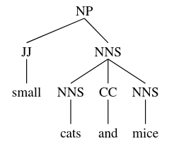
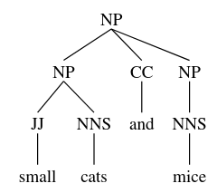
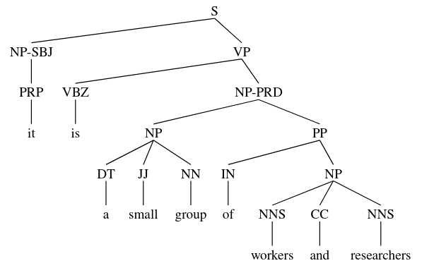
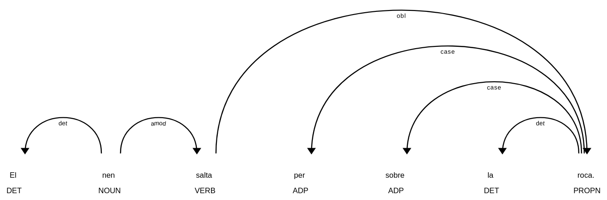
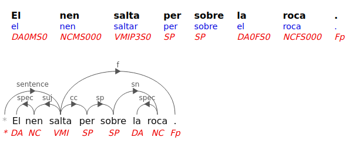

class: center, middle

## Processament del Llenguatge Humà

# Lab.7: frases - *parsing*

### Gerard Escudero, Salvador Mediana i Jordi Turmo

## Grau en Intel·ligència Artificial


<br>


---
class: left, middle, inverse

# Outline

- .cyan[Parsing de constituents]

  - No probabilístics

  - Probabilístics

- Parsing de dependències

- Exercici

---

# Parsing de constituents amb l'NLTK

### Parsers no probabilístics

* ChartParser (default parser is BottomUpLeftCornerChartParser)

* BottomUpChartParser, LeftCornerChartParser

* TopDownChartParser, EarleyChartParser

* ...

### Parsers probabilístics

* InsideChartParser, RandomChartParser, LongestChartParser (bottom-up parsers)

* ViterbiParser

* CoreNLPParser (Standford CoreNLP)

* ...

---
class: left, middle, inverse

# Outline

- .cyan[Parsing de constituents]

  - .cyan[No probabilístics]

  - Probabilístics

- Parsing de dependències

- Exercici

---

# Charts I

### Requeriments

```python3
import nltk
from nltk import CFG, ChartParser
!pip install svgling
import svgling
```

### Ús

```python3
grammar = CFG.fromstring('''
  NP  -> NNS | JJ NNS | NP CC NP
  NNS -> "cats" | "dogs" | "mice" | NNS CC NNS 
  JJ  -> "big" | "small"
  CC  -> "and" | "or"
  ''')

parser = ChartParser(grammar, trace=1)

parse = parser.parse(['small', 'cats', 'and', 'mice'])
👉
```

---

# Charts II

```
|.  small  .   cats  .   and   .   mice  .|
|[---------]         .         .         .| [0:1] 'small'
|.         [---------]         .         .| [1:2] 'cats'
|.         .         [---------]         .| [2:3] 'and'
|.         .         .         [---------]| [3:4] 'mice'
|[---------]         .         .         .| [0:1] JJ -> 'small' *
|[--------->         .         .         .| [0:1] NP -> JJ * NNS
|.         [---------]         .         .| [1:2] NNS -> 'cats' *
|.         [---------]         .         .| [1:2] NP -> NNS *
|.         [--------->         .         .| [1:2] NNS -> NNS * CC NNS
|[-------------------]         .         .| [0:2] NP -> JJ NNS *
|[------------------->         .         .| [0:2] NP -> NP * CC NP
|.         [--------->         .         .| [1:2] NP -> NP * CC NP
|.         .         [---------]         .| [2:3] CC -> 'and' *
|.         [------------------->         .| [1:3] NNS -> NNS CC * NNS
|[----------------------------->         .| [0:3] NP -> NP CC * NP
|.         [------------------->         .| [1:3] NP -> NP CC * NP
|.         .         .         [---------]| [3:4] NNS -> 'mice' *
|.         .         .         [---------]| [3:4] NP -> NNS *
|.         .         .         [--------->| [3:4] NNS -> NNS * CC NNS
|.         [-----------------------------]| [1:4] NNS -> NNS CC NNS *
|.         [-----------------------------]| [1:4] NP -> NNS *
|.         [----------------------------->| [1:4] NNS -> NNS * CC NNS
|[=======================================]| [0:4] NP -> JJ NNS *
|[--------------------------------------->| [0:4] NP -> NP * CC NP
|.         [----------------------------->| [1:4] NP -> NP * CC NP
|.         .         .         [--------->| [3:4] NP -> NP * CC NP
|[=======================================]| [0:4] NP -> NP CC NP *
|.         [-----------------------------]| [1:4] NP -> NP CC NP *
|.         [----------------------------->| [1:4] NP -> NP * CC NP
|[--------------------------------------->| [0:4] NP -> NP * CC NP
```

---

# Charts III

### Resultats

```python3
ts = list(parse)

'{num} arbres.'.format(num=len(ts))
👉  2 arbres.

print(ts[0])
👉  (NP (JJ small) (NNS (NNS cats) (CC and) (NNS mice)))
```

.cols5050[
.col1[
```python3
ts[0]
👉
```

]
.col2[
```python3
ts[1]
👉
```

]]

---

# Charts IV

### Diferents estrategies

- BottomUpChartParser

- BottomUpLeftCornerChartParser

- EarleyChartParser

- ...

### Exemple d'ús

```python3
from nltk import TopDownChartParser
parser = nltk.TopDownChartParser(grammar)
parse = parser.parse(sent)
```

---
class: left, middle, inverse

# Outline

- .cyan[Parsing de constituents]

  - .brown[No probabilístics]

  - .cyan[Probabilístics]

- Parsing de dependències

- Exercici

---

# Charts probabilístics I

### Requeriments

```python3
import nltk
from nltk.parse.pchart import PCFG, InsideChartParser
!pip install svgling
import svgling
```

### Ús

```python3
grammar = PCFG.fromstring('''
  NP  -> NNS [0.5] | JJ NNS [0.3] | NP CC NP [0.2]
  NNS -> "cats" [0.1] | "dogs" [0.2] | "mice" [0.3] | NNS CC NNS [0.4]
  JJ  -> "big" [0.4] | "small" [0.6]
  CC  -> "and" [0.9] | "or" [0.1]
  ''')

parser = InsideChartParser(grammar)
parse = parser.parse(['small', 'cats', 'and', 'mice'])
```

---

# Charts probabilístics II

### Resultats

```python3
ts = list(parse)

'{num} arbres.'.format(num=len(ts))
👉  2 arbres.

[print(t) for t in ts]
👉
(NP (JJ small) (NNS (NNS cats) (CC and) (NNS mice))) (p=0.001944)
(NP (NP (JJ small) (NNS cats)) (CC and) (NP (NNS mice))) (p=0.000486)
```

### Notes

- Estrategies *bottom-up*

- InsideChartParser, RandomChartParser, LongestChartParser

---

# ViterbiParser I

### Requeriments

```python3
import nltk
from nltk import  PCFG, ViterbiParser
!pip install svgling
import svgling
```

### Ús

```python3
grammar = PCFG.fromstring('''
  NP  -> NNS [0.5] | JJ NNS [0.3] | NP CC NP [0.2]
  NNS -> "cats" [0.1] | "dogs" [0.2] | "mice" [0.3] | NNS CC NNS [0.4]
  JJ  -> "big" [0.4] | "small" [0.6]
  CC  -> "and" [0.9] | "or" [0.1]
  ''')

parser = ViterbiParser(grammar)
parse = parser.parse(['small', 'cats', 'and', 'mice'])
```

---

# ViterbiParser II

### Resultats

```python3
ts = list(parse)

'{num} arbres.'.format(num=len(ts))
👉  1 arbres.

[print(t) for t in ts]
👉
(NP (JJ small) (NNS (NNS cats) (CC and) (NNS mice))) (p=0.001944)
```

---

# Aprendre PCFGs I

### Requeriments

```python3
import nltk
nltk.download('treebank')
from nltk.corpus import treebank
from nltk import PCFG, ViterbiParser
!pip install svgling
import svgling
```

### DataSet

```python3
productions = []
S = nltk.Nonterminal('S')
for f in treebank.fileids():
    for tree in treebank.parsed_sents(f):
        productions += tree.productions()
```

---

# Aprendre PCFGs II

### Aprenentatge

```python3
grammar = nltk.induce_pcfg(S, productions)

len(grammar.productions())  👉  21763

grammar.productions()[10:15]
👉
[JJ -> 'old' [0.00411382],
 VP -> MD VP [0.0523088],
 MD -> 'will' [0.30205],
 VP -> VB NP PP-CLR NP-TMP [0.000137836],
 VB -> 'join' [0.00156617]]
```

---

# Aplicació de la PCFG I

### Ús

```python3
sent = ['it', 'is', 'a', 'small', 'group', 'of', 'workers', 'and', 'researchers']
parser = ViterbiParser(grammar)
parse = parser.parse(sent)

tree = next(parse)
print(tree)
👉
(S
  (NP-SBJ (PRP it))
  (VP
    (VBZ is)
    (NP-PRD
      (NP (DT a) (JJ small) (NN group))
      (PP
        (IN of)
        (NP (NNS workers) (CC and) (NNS researchers)))))) (p=2.64379e-21)
```

---

# Aplicació de la PCFG II

### Gràfic

```python3
tree
👉
```



---
class: left, middle, inverse

# Outline

- .brown[Parsing de constituents]

  - .brown[No probabilístics]

  - .brown[Probabilístics]

- .cyan[Parsing de dependències]

- Exercici

---

# Dependències amb spaCy I

### Requeriments

```python3
import spacy
!python -m spacy download ca_core_news_sm
nlp = spacy.load("ca_core_news_sm")
```

### Ús

```python3
doc = nlp('El nen salta per sobre la roca.')

[(token.text, token.tag_, token.dep_, token.head) for token in doc]
👉
[('El', 'DET', 'det', nen),
 ('nen', 'NOUN', 'ROOT', nen),
 ('salta', 'VERB', 'amod', nen),
 ('per', 'ADP', 'case', roca),
 ('sobre', 'ADP', 'case', roca),
 ('la', 'DET', 'det', roca),
 ('roca', 'PROPN', 'obl', salta),
 ('.', 'PUNCT', 'punct', nen)]
```

---

# Dependències amb spaCy II

### Gràfic

```python3
spacy.displacy.render(doc,style='dep',jupyter=True)
👉
```



---

# Dependències amb TextServer I

### Requeriments

- Script auxiliar: [textserver.py](../codes/textserver.py)

```
from google.colab import drive
import sys

drive.mount('/content/drive')
sys.path.insert(0, '/content/drive/My Drive/Colab Notebooks/plh')
from textserver import TextServer
```

---

# Dependències amb TextServer II

### Ús

```python3
ts = TextServer('user', 'passwd', 'dependencies')

ts.dependencies('El nen salta per sobre la roca.')
👉
[{'function': 'sentence',
  'word': 'salta',
  'children': [{'function': 'suj',
    'word': 'nen',
    'children': [{'function': 'spec', 'word': 'El'}]},
   {'function': 'cc',
    'word': 'per',
    'children': [{'function': 'sp',
      'word': 'sobre',
      'children': [{'function': 'sn',
        'word': 'roca',
        'children': [{'function': 'spec', 'word': 'la'}]}]}]},
   {'function': 'f', 'word': '.'}]}]
```

---

# Dependències a FreeLing



.footnote[[https://nlp.lsi.upc.edu/freeling/demo/demo.php](https://nlp.lsi.upc.edu/freeling/demo/demo.php)]
---
class: left, middle, inverse

# Outline

- .brown[Parsing de constituents]

  - .brown[No probabilístics]

  - .brown[Probabilístics]

- .brown[Parsing de dependències]

- .cyan[Exercici]

---

# Exercici

- Apliqueu els parsers anteriors a les frases següents:

  - El nen salta per sobre la roca.

  - Estic menjant una taronja mentre miro la televisió.

  - És un petit grup de treballadors i investigadors.

- Compareu els resultats

- Quines conclussions en podeu treure?

