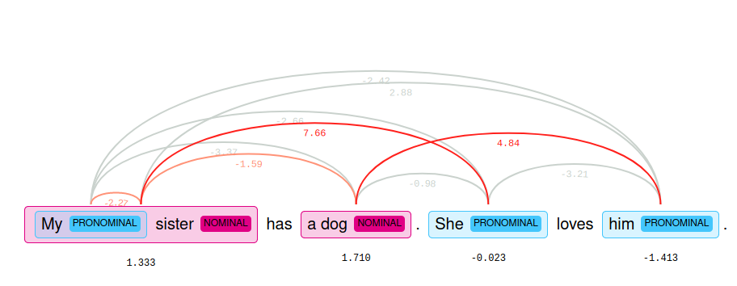

class: center, middle

## Processament del Llenguatge Humà

# Lab.8: text - coreferència

### Gerard Escudero, Salvador Medina i Jordi Turmo

## Grau en Intel·ligència Artificial

<br>


---
class: left, middle, inverse

# Outline

- .cyan[Documentació]

  - .cyan[Coreferència]

- Exercici

---

# Coreferència amb spaCy I

### Requeriments

```python3
!pip install spacy==2.1.0
!python -m spacy download en_core_web_sm
!pip install neuralcoref

import spacy
import neuralcoref

nlp = spacy.load('en_core_web_sm')
neuralcoref.add_to_pipe(nlp)
```

### Ús

```python3
doc = nlp(u'My sister has a dog. She loves him.')

doc._.has_coref  👉  True

doc._.coref_clusters
👉  [My sister: [My sister, She], a dog: [a dog, him]]
```

---

# Coreferència amb spaCy II

### Representació visual




### Referència

* Neural Coreference - Hugging Face <br>
[https://huggingface.co/coref/](https://huggingface.co/coref/)

---

# Coreferència amb Textserver

### Requeriments

```python3
from google.colab import drive
import sys
drive.mount('/content/drive')
sys.path.insert(0, '/content/drive/My Drive/Colab Notebooks/plh')
from textserver import TextServer
```

### Ús

```python3
ts = TextServer('usuari', 'passwd', 'coreferences')

ts.coreferences("My sister has a dog. She loves him.")
👉  [['My sister', 'him'], ['a dog', 'She']]
```

---
class: left, middle, inverse

# Outline

- .brown[Documentació]

  - .brown[Coreferència]

- .cyan[Exercici]

---

# Exercici

### Dades

* Primer paràgraf d' *Alice’s Adventures in Wonderland* de *Lewis Carroll*:
```
Alice was beginning to get very tired of sitting by her sister on the bank, 
and of having nothing to do: once or twice she had peeped into the book her 
sister was reading, but it had no pictures or conversations in it, ‘and what 
is the use of a book,’ thought Alice ‘without pictures or conversations?’
```

* Referència: <br>
[http://www.gutenberg.org/files/11/11-0.txt](http://www.gutenberg.org/files/11/11-0.txt)

### Enunciat 

* Apliqueu les coreferències d'spaCy i TextServer sobre el paràgraf anterior

* Mostreu les cadenes de coreferència

* Compareu els resultats.

* Què en penseu del resultats?


