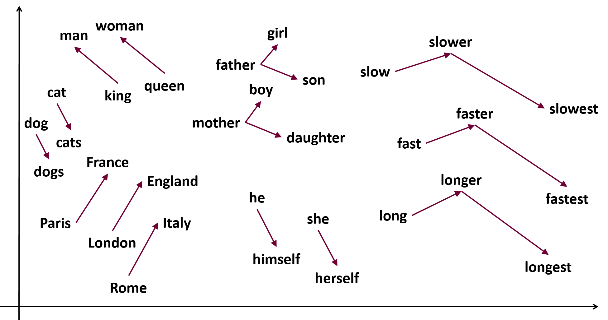

class: center, middle

## Processament del Llenguatge Humà

# Lab. 10: Word Embeddings

### Gerard Escudero, Salvador Medina i Jordi Turmo

## Grau en Intel·ligència Artificial

<br>


---
class: left, middle, inverse

# Sumari

- .cyan[Word Embeddings]
  - .cyan[Word Embeddings amb Gensim]
  - Visualització d'Embeddings
  - FastText amb Gensim
  - Memory Maps, Reducció de Dimensionalitat
  - Ponderació d'Embeddings
  - Word Embeddings amb spaCy
- Exercici
- Pràctica 4

---

# Word Embeddings amb Gensim

### Descarregar model pre-entrenats

Podeu descarregar models pre-entrenats de diferents llocs web

##### word2vec, fastText, ELMo, ...

[http://vectors.nlpl.eu/repository/](http://vectors.nlpl.eu/repository/)

#### Carregar un model amb Gensim

```python
from gensim.models import KeyedVectors
# Word2vec permet dos formats: text i binari
kv = KeyedVectors.load_word2vec_format('model.bin', binary=True)
# Obtenir un word-vector
print(kv["paraula"]) # -> NDArray
```

---

# Word Embeddings amb Gensim

#### Entrenar un model amb Gensim
``` python
from nltk.corpus import europarl
corpus = europarl_raw.spanish.words()
# Entrenar el model
from gensim.models import word2vec
model = word2vec.Word2Vec(corpus, vector_size=100, window=5, min_count=10, workers=4, epochs=25)
# Obtenir un word-vector
print(model.wv["parlamento"]) # -> NDArray
# <!> Aquest dataset és massa petit, els embeddings generats no són de bona qualitat
```

---

# Analogies amb Gensim



---

# Analogies amb Gensim (II)

### Calcular paraules més similars

```python
kv.most_similar("vector", topn=5) # Suposant que 'kv' és el model carregat
# -> [('vectors', 0.8542011380195618), ('runge-lenz', 0.8305273652076721), ...]
```

### Analogies

Rei és a Home com Reina és a Dona: `home - rei + dona = reina`

```python
kv.most_similar(positive=["banc", "cadira"], negative=["diners"], topn=5)
# -> [('respatller', 0.6335902810096741), ('tamboret', 0.6063637137413025), ('bkf', 0.5890117287635803), ('seient', 0.5850768089294434), ('arw2', 0.5678388476371765)]
```

### Altres

```python
kv.doesnt_match(["cadira", "sofa", "gat", "butaca"])
# -> 'gat'
```

---

# Avaluació amb Gensim

#### Descarregar datasets d'avaluació

[https://github.com/vecto-ai/word-benchmarks](https://github.com/vecto-ai/word-benchmarks)
[https://github.com/RaRe-Technologies/gensim/tree/develop/gensim/test/test_data](https://github.com/RaRe-Technologies/gensim/tree/develop/gensim/test/test_data)

# Avaluar Analogies
```python
from gensim.test.utils import datapath
analogies_result = kv.evaluate_word_analogies(datapath('questions-words.txt'))
print(analogies_result[0])
```

**Nota:** El fitxer `questions-words.txt` és per a anglès. Necessitaríeu un equivalent en català per avaluar correctament un model en català.

# Avaluar Similitud
```
analogies_result = kv.evaluate_word_pairs(datapath('wordsim353.tsv'))
print(analogies_result) # -> (pearson, spearman, oov_ratio, ) 
```

---

# Visualitzar Word Embeddings amb t-SNE

```python
from sklearn.manifold import TSNE
import pandas as pd
import matplotlib.pyplot as plt

# "vocab" és una llista de paraules que volem visualitzar
X = model.wv[vocab]
# Entrenar el model de t-SNE
tsne = TSNE(n_components=2)
X_tsne = tsne.fit_transform(X)
# Crea un Dataframe
df = pd.DataFrame(X_tsne, index=vocab, columns=['x', 'y'])
# Imprimeix
fig = plt.figure()
ax = fig.add_subplot(1, 1, 1)
ax.scatter(df['x'], df['y'])
# Afegeix les etiquetes
for word, pos in df.iterrows():
    ax.annotate(word, pos)
```

---

# FastText amb Gensim

### També podeu carregar models de FastText amb Gensim

```python
import gensim
# Soporta .bin (binari) i .vec (text pla)
model = gensim.models.fasttext.load_facebook_model('cc.en.300.bin.gz')
```

### OOV amb FastText
```python
'somethingweird' in kv.key_to_index 
# -> False
oov_vector = kv['somethingweird'] 
# -> NDArray
```

### N-gram Hashes

```python
buckets = gensim.models.fasttext.ft_ngram_hashes('somethingweird', kv.min_n, kv.max_n, kv.bucket)
# Podem obtenir el vector associat al bucket i=0
bucket_vector = kv.vectors_ngrams[buckets[0]]
# I obtenir la paraula més propera
closest = kv.similar_by_vector(bucket_vector)
# -> [('somel', 0.47820645570755005), ('somely', 0.4769449234008789), ('some.There', 0.4228570759296417), ('somey', 0.3758257031440735), ('countlessly', 0.36373358964920044)]
```

---

# Gensim soporta Memory Maps (mmaps)

Per a models molt grans, carregar tots els vectors a la RAM pot ser un problema. `mmap` permet accedir als vectors directament des del disc (només lectura).

```python
# Heu de guardar el model en un format compatible
model.save('model.bin')
# Llavors podeu carregar el model com a mmap
from gensim.models import FastText
model = FastText.load('model.bin', mmap='r')
```

---

# Reducció de Dimensionalitat d'Embeddings

Si encara teniu problemes de RAM, una alternativa pot ser la reducció de dimensionalitat dels embeddings. Hi ha diferents maneres de fer-ho.

1.  **Truncament (Slicing):** Més simple i ràpid.
    ```python
    embedding_50d = embedding_300d[:50]
    ```

2.  **Selecció de Dimensions per Variància:** Selecciona les $N$ dimensions amb més variància a través del vocabulari. Més informat que el truncament.

    ```python
    variances = np.var(all_embeddings_300d, axis=0)
    top_n_indices = np.argsort(variances)[::-1][:N]
    word_embedding_Nd = kv['paraula'][top_n_indices]
    ```

3.  **Projeccions Aleatòries (Random Projections):** Projecta a menor dimensió amb una matriu aleatòria. Eficient i teòricament sòlid.

    ```python
    from sklearn.random_projection import GaussianRandomProjection
    transformer = GaussianRandomProjection(n_components=N)
    all_embeddings_Nd = transformer.fit_transform(all_embeddings_300d)
    ```
    
---

4. **Agregació de Blocs (Chunk Averaging):** Divideix el vector en blocs i calcula la mitjana de cada bloc. Heurística ràpida.

    ```python
    chunk_size = D_original // D_target
    new_embedding = [np.mean(emb_original[i:i+chunk_size]) for i in range(0, D_target*chunk_size, chunk_size)]
    ```

5. **Anàlisi de Components Principals (PCA):** Troba les $N$ dimensions que maximitzen la variància. Pot preservar millor la informació. Requereix "entrenar" el PCA.

    ```python
    from sklearn.decomposition import PCA
    pca = PCA(n_components=N)
    all_embeddings_Nd = pca.fit_transform(all_embeddings_300d)
    ```

**Recomanació per la pràctica:** Començar amb **Truncament** per la seva simplicitat.

---

# Ponderació d'Embeddings amb TF-IDF

Per obtenir un embedding d'un document, es pot fer la mitjana ponderada dels embeddings de les seves paraules, utilitzant TF-IDF com a pes. 
$V\_d = \\frac{\\sum\_{t \\in d} TF-IDF(t, d, D) \\cdot V\_t}{\\sum\_{t \\in d} TF-IDF(t, d, D)}$

```python
from sklearn.feature_extraction.text import TfidfVectorizer
import numpy as np

corpus_text = ["frase de mostra u", "una altra frase de text"] # Les frases del vostre dataset
vectorizer = TfidfVectorizer(use_idf=True, smooth_idf=True, norm=None) # norm=None per pesos directes
tfidf_matrix = vectorizer.fit_transform(corpus_text)
feature_names = np.array(vectorizer.get_feature_names_out())
kv = model.wv # El vostre model d'embeddings (Gensim KeyedVectors)

# Exemple d'ús per a la primera frase:
sent_vector = get_weighted_sentence_vector(corpus_text[0], tfidf_matrix[0], kv)
```

---

```python
def get_weighted_sentence_vector(sentence_text, tfidf_row_vec, model_kv):
    doc_indices = tfidf_row_vec.indices
    doc_tfidf_scores = tfidf_row_vec.data
    
    weighted_vectors_sum = np.zeros(model_kv.vector_size, dtype=np.float32)
    total_weight = 0.0
    
    for idx, score in zip(doc_indices, doc_tfidf_scores):
        word = feature_names[idx]
        if word in model_kv:
            weighted_vectors_sum += score * model_kv[word]
            total_weight += score
            
    if total_weight == 0: # Si cap paraula tenia embedding o score>0
        # Fallback: mitjana simple de les paraules presents al model (sense TF-IDF)
        words_in_sentence = sentence_text.lower().split()
        plain_vectors = [model_kv[w] for w in words_in_sentence if w in model_kv]
        if plain_vectors:
            return np.mean(plain_vectors, axis=0)
        return np.zeros(model_kv.vector_size, dtype=np.float32)
        
    return weighted_vectors_sum / total_weight
```

---

# Word Embeddings amb spaCy

### Obtenir Word-Embeddings amb spaCy

spaCy facilita l'accés a diferents tipus d'embeddings.

```python
import spacy
nlp = spacy.load("en_core_web_md")
sentence = nlp("I sit on a bank.")
sentence[4].vector
# -> NDArray  # Vector de la paraula bank
```

```python
print(doc[4].vector.shape) # (300,) si el model els inclou
# Vector del document (per defecte, la mitjana dels vectors de les paraules)
print(doc.vector.shape) # (300,)
```

---

### Models Transformer amb spaCy

```python
# Models (_trf) utilitzen Transformers (com RoBERTa) per embeddings contextuals.
nlp_trf = spacy.load("ca_core_news_trf") # Model Transformer en català
doc_trf = nlp_trf("El banc ha aprovat el crèdit del banc de peixos.")
# El vector de 'banc' serà diferent en cada context.
# L'accés als embeddings pot ser via doc._.trf_data o extensions específiques.
```

Per a la Pràctica 4, comparareu embeddings estàtics (Word2Vec, spaCy `_md`) amb embeddings derivats de Transformers.

---

# Exercici:

### Experimenta amb els Word Vectors
- Prova diferents models pre-entrenats.
- Defineix analogies i sinònims.
- Visualitza aquestes analogies i sinònims amb t-SNE.

### Avaluació dels Word Embeddings alineats (opcional)
- Utilitza Word Embeddings alineats per traduir una part del conjunt de proves d'analogies.
- Avalua el model de català amb aquest conjunt de proves.


---

class: left, middle, inverse

# Pràctica 4: Similitud Semàntica de Textos

---

# Pràctica 4: Enunciat (1/3)

**Objectiu principal:** Entrenar i avaluar models de Similitud de Text Semàntic (STS) per al català.

**Datasets:**

  - **Text Similarity (STS-ca):** [projecte-aina/sts-ca](https://huggingface.co/datasets/projecte-aina/sts-ca) (principal per a l'entrenament i avaluació). Puntuacions de similitud entre 0 i 5.
  - **Font d'Embeddings:** Un model Word2Vec pre-entrenat sobre català de 300 dimensions (ex: `cc.ca.300.vec` de FastText, o un model Word2Vec de qualitat). Anomenem-lo `model_300d.kv`.

**Tasques principals:**

(1.)  **Preparació d'Embeddings:**
      * Carregar el model `model_300d.kv`.
      * Generar versions d'embeddings de dimensions més petites (ex: 50, 100, 150 dimensions) a partir del model de 300 dimensions (ex: mitjançant truncament).

---

# Pràctica 4: Enunciat (2/3)

(2.)  **Entrenament i Avaluació de Models de Similitud Textual Semàntica (STS):**
* **Representació de les frases:**

    * Mitjana simple dels embeddings de les paraules.
    * Mitjana ponderada amb TF-IDF dels embeddings de les paraules.

* **Models a comparar:**

  * **Baseline Cosinus:**
      * Representar cada frase com un vector (mitjana o mitjana ponderada TF-IDF).
      * Calcular la similitud cosinus entre els dos vectors. No s'entrena.
  * **Model de Regressió 1 (Embeddings Agregats):**
      * Input: Dos vectors agregats (un per frase).
      * Arquitectura: Transformació (Dense) $\\rightarrow$ Sortida (valor de similitud).
  * **Model de Regressió 2 (Seqüència d'Embeddings):**
      * Input: Dues seqüències d'embeddings de paraules (o índexs de paraules).
      * Arquitectura: Capa d'Embedding $\\rightarrow$ Capa d'agregació (Ex: GlobalAveragePooling, o Atenció) $\\rightarrow$ Transformació (Dense) $\\rightarrow$ Sortida.
---
* **Altres (Comparativa Avançada):**
    * One-Hot (com a baseline molt simple, limitar vocabulari).
    * Embeddings de spaCy (`ca_core_news_md` - mitjana).
    * Embeddings de RoBERTa (`projecte-aina/roberta-base-ca-v2` o via spaCy `ca_core_news_trf` - vector CLS o mitjana).
    * Model RoBERTa fine-tuned per STS (ex: `projecte-aina/roberta-base-ca-v2-cased-sts`).

---

# Pràctica 4: Enunciat (3/3)

(3.)  **Experimentació amb Embeddings Entrenables (per als Models de Regressió):**

* Entrenar els models de regressió (podeu fer servir el Model 2) amb una capa d'embeddings que s'inicialitzi de diferents maneres i que es pugui fine-tunejar:
    * Inicialització aleatòria.
    * Inicialització amb els vostres embeddings pre-entrenats (Word2Vec de diferents dimensions).
* Analitzar si permetre el fine-tuning dels embeddings millora el rendiment.

(4.)  **Anàlisi de Resultats:**

* Comparar el rendiment dels diferents models i configuracions.
* Analitzar l'impacte de la dimensionalitat dels embeddings, ponderació TF-IDF, ús d'atenció, etc.

**Opcional:**

  - Entrenar un model de classificació amb el conjunt de dades [Text Classification (TECLA)](https://huggingface.co/datasets/projecte-aina/tecla).

---

# Pràctica 4: Baseline Cosinus

Calcula la similitud cosinus entre les representacions vectorials agregades de les dues frases. No requereix entrenament.

**Passos:**

1.  Per a cada frase (sent1, sent2) del dataset STS:
    1. Tokenitzar la frase.
    2. Per a cada token, obtenir el seu vector d'embedding (`model_kv`).
    3. **Representació de la frase (Vector Agregat):**
        * **Opció A: Mitjana Simple:** `np.mean([model_kv[t] for t in tokens if t in model_kv], axis=0)`
        * **Opció B: Mitjana Ponderada amb TF-IDF:** Utilitzar la funció `get_weighted_sentence_vector` definida anteriorment.
2.  Calcular la similitud cosinus entre el vector de sent1 i el de sent2.
3.  Avaluar contra els gold scores (Correlació de Pearson).

---

# Pràctica 4: Exemple Model 1 (Agregats)

Aquest model rep com a entrada els vectors de frase ja agregats.

```python
import tensorflow as tf

def build_model_aggregated(embedding_dim: int, hidden_size: int = 128, dropout_rate: float = 0.3) -> tf.keras.Model:
    input_1 = tf.keras.Input(shape=(embedding_dim,), name="input_vector_1")
    input_2 = tf.keras.Input(shape=(embedding_dim,), name="input_vector_2")
    
    concatenated = tf.keras.layers.Concatenate(axis=-1)([input_1, input_2])
    x = tf.keras.layers.BatchNormalization()(concatenated)
    
    x = tf.keras.layers.Dense(hidden_size, activation='relu')(x)
    x = tf.keras.layers.BatchNormalization()(x)
    x = tf.keras.layers.Dropout(dropout_rate)(x)
    
    output = tf.keras.layers.Dense(1)(x) # Activació lineal per a regressió
    
    model = tf.keras.Model(inputs=[input_1, input_2], outputs=output)
    model.compile(loss='mean_squared_error', optimizer=tf.keras.optimizers.Adam(learning_rate=0.001),
                  metrics=['mae', tf.keras.metrics.RootMeanSquaredError()])
    return model

model_agg = build_model_aggregated(embedding_dim=300)
model_agg.fit([X1_train, X2_train], Y_train, epochs=..., batch_size=...)
```

---

# Pràctica 4: Mecanisme d'Atenció

Per al Model 2, en lloc d'una simple mitjana (`GlobalAveragePooling`), l'atenció permet ponderar la importància de cada paraula en la frase.

**Idea Bàsica (Self-Attention Simple per Pooling):**
Per a una seqüència d'embeddings $(e\_1, \\ldots, e\_L)$:

1.  Calcular "scores" d'importància $s\_i = \\tanh(W\_1 e\_i + b\_1)$.
2.  Normalitzar els scores (softmax) per obtenir pesos $\\alpha\_i = \\frac{\\exp(s\_i)}{\\sum \\exp(s\_j)}$.
3.  El vector de frase $v\_{frase} = \\sum \\alpha\_i \\cdot e\_i$.

Aquest $v\_{frase}$ és una representació més rica que una simple mitjana.

---

```python
import tensorflow as tf

class SimpleAttention(tf.keras.layers.Layer):
    def __init__(self, units=128, **kwargs):
        super(SimpleAttention, self).__init__(**kwargs)
        self.units = units
        self.W1 = tf.keras.layers.Dense(units, activation='tanh')
        self.W2 = tf.keras.layers.Dense(1) # Per obtenir el score final per cada pas de temps

    def call(self, inputs, mask=None): # `inputs` shape: (batch, seq_len, embedding_dim)
        ui = self.W1(inputs) # (batch, seq_len, self.units)
        scores = self.W2(ui) # (batch, seq_len, 1)
        scores = tf.squeeze(scores, axis=-1) # (batch, seq_len)

        if mask is not None: # La màscara prové de la capa Embedding (mask_zero=True)
            scores = tf.where(mask, scores, tf.fill(tf.shape(scores), -1e9)) # Aplica la màscara

        alpha = tf.keras.activations.softmax(scores, axis=-1) # (batch, seq_len)
        alpha_expanded = tf.expand_dims(alpha, axis=-1) # (batch, seq_len, 1)
        
        context_vector = tf.reduce_sum(alpha_expanded * inputs, axis=1) # (batch, embedding_dim)
        return context_vector

    def get_config(self):
        config = super().get_config()
        config.update({'units': self.units})
        return config
```

---

# Pràctica 4: Exemple Model 2 (Seqüencial)

Aquest model rep seqüències d'índexs de paraules, utilitza una capa d'embedding i una capa d'agregació (Pooling o Atenció).

```python
def build_model_sequential(
    input_length: int, dictionary_size: int, embedding_dim: int, 
    dense_hidden_size: int = 128, dropout_rate: float = 0.3,
    embedding_matrix=None, trainable_embeddings: bool = False,
    use_attention: bool = False, attention_units: int = 64 
) -> tf.keras.Model:

    input_1 = tf.keras.Input(shape=(input_length,), dtype=tf.int32, name="input_tokens_1")
    input_2 = tf.keras.Input(shape=(input_length,), dtype=tf.int32, name="input_tokens_2")

    embedding_layer = tf.keras.layers.Embedding(
        input_dim=embedding_matrix.shape[0] if embedding_matrix is not None else dictionary_size, 
        output_dim=embedding_dim, input_length=input_length, 
        weights=[embedding_matrix] if embedding_matrix is not None else None,
        trainable=trainable_embeddings, mask_zero=True
    )          
    embedded_1 = embedding_layer(input_1)
    embedded_2 = embedding_layer(input_2)

    if use_attention:
        # Assegureu-vos que SimpleAttention està definida
        agg_layer_1 = SimpleAttention(units=attention_units, name="attention_1")
        agg_layer_2 = SimpleAttention(units=attention_units, name="attention_2")
    else:
        agg_layer_1 = tf.keras.layers.GlobalAveragePooling1D(name="gap_1")
        agg_layer_2 = tf.keras.layers.GlobalAveragePooling1D(name="gap_2")
    
    pooled_1 = agg_layer_1(embedded_1, mask=embedding_layer.compute_mask(input_1) if use_attention else None) 
    pooled_2 = agg_layer_2(embedded_2, mask=embedding_layer.compute_mask(input_2) if use_attention else None)

    concatenated = tf.keras.layers.Concatenate(axis=-1)([pooled_1, pooled_2])
    x = tf.keras.layers.BatchNormalization()(concatenated)
    x = tf.keras.layers.Dense(dense_hidden_size, activation='relu')(x)
    x = tf.keras.layers.BatchNormalization()(x)
    x = tf.keras.layers.Dropout(dropout_rate)(x)    
    output = tf.keras.layers.Dense(1)(x)
    
    model = tf.keras.Model(inputs=[input_1, input_2], outputs=output)
    model.compile(loss='mean_squared_error', optimizer=tf.keras.optimizers.Adam(0.001), 
                  metrics=['mae', tf.keras.metrics.RootMeanSquaredError()])
    return model
```

---

# Pràctica 4: Capa de Sortida Alternativa

Com a capa de sortida alternativa podeu fer servir la distància cosinus.

```python
projected_1 = tf.linalg.l2_normalize(vector_1, axis=1, )
projected_2 = tf.linalg.l2_normalize(vector_2, axis=1, )
output = 2.5 * (1.0 + tf.reduce_sum(projected_1 * projected_2, axis=1, ))
```

Però no te weights, haureu d'afegir una transformació. Per exemple:

```python
projection = tf.keras.layers.Dense(
    embedding_size,
    kernel_initializer=tf.keras.initializers.Identity(),
    bias_initializer=tf.keras.initializers.Zeros(),
)
vector_1 = projection(input_1)
vector_2 = projection(input_2)
```

---

# Pràctica 4: Notes sobre Implementació

  * **Tokenització:** Converteix les frases del dataset STS-ca a seqüències d'índexs de paraules.
      * Necessitareu un mapatge `paraula -> índex` (vocabulari).
      * Considerar tokens especials com `<PAD>` (per padding) i `<UNK>` (per paraules desconegudes).
  * **Padding:** Assegurar que totes les seqüències d'entrada al Model 2 tinguin la mateixa longitud (`input_length`). La capa `mask_zero=True` en `Embedding` ajuda a ignorar el padding.
  * **Matriu d'Embeddings Pre-entrenats:** Per al Model 2, si useu embeddings pre-entrenats, creeu una matriu on la fila $i$ sigui el vector de la paraula amb índex $i$ al vostre vocabulari. Les paraules sense embedding pre-entrenat poden rebre un vector zero o aleatori.
  * **Avaluació Final:** La mètrica principal per a STS és la **Correlació de Pearson** entre les puntuacions predites i les reals. Calculeu-la sobre el conjunt de test.
    ```python
    from scipy.stats import pearsonr
    y_pred = model.predict([X1_test, X2_test])
    pearson_corr, _ = pearsonr(Y_test.flatten(), y_pred.flatten())
    ```
  * **Experimentació:** Aquesta pràctica és una oportunitat per experimentar\! Proveu diferents dimensions d'embeddings, arquitectures, hiperparàmetres, i analitzeu-ne l'impacte. No hi ha una única "millor" solució.

---

# Llibreria `datasets` de Hugging Face

La llibreria `datasets` de Hugging Face facilita la càrrega i processament de grans datasets, incloent els que utilitzareu a la Pràctica 4.

```python
from datasets import load_dataset

# Text Similarity (STS) dataset (principal per la Pràctica 4)
sts_ca_dataset = load_dataset("projecte-aina/sts-ca", split="test") # O 'train', 'validation'
print(sts_ca_dataset[0])
# {'sentence1': 'Un home està fregant un terra.', 'sentence2': 'Un home està fregant un terra.', 'score': 5.0, ...}
```

```python
# Catalan General Crawling (per si volguéssiu entrenar embeddings des de zero)
# Es recomana utilitzar streaming per a datasets molt grans
cc_ca_dataset = load_dataset("projecte-aina/catalan_general_crawling", name="clean", split="train", streaming=True)
for example in cc_ca_dataset.take(1): # Agafa només el primer exemple
  print(example['text'])
```

```python
# Text Classification (TECLA) dataset (per la part opcional)
tecla_dataset = load_dataset("projecte-aina/tecla", name="categorization", split="train")
print(tecla_dataset[0])
```
