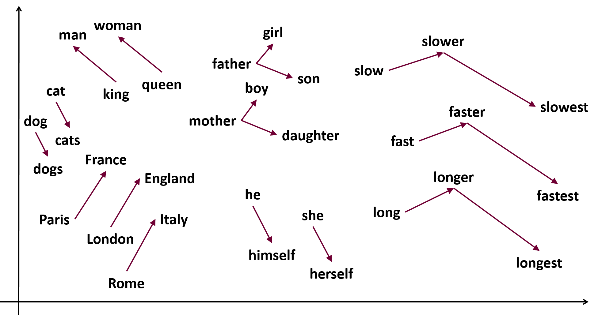

class: center, middle

## Processament del Llenguatge Humà

# Lab. 10: Word Embeddings

### Gerard Escudero, Salvador Medina i Jordi Turmo

## Grau en Intel·ligència Artificial

<br>


---
class: left, middle, inverse

# Sumari

- .cyan[Word Embeddings]
  - .cyan[Word Embeddings amb Gensim]
  - Visualització d'Embeddings
  - FastText amb Gensim
  - Memory Maps, Reducció de Dimensionalitat
  - Ponderació d'Embeddings
  - Word Embeddings amb spaCy
- Exercici
- Pràctica 4

---

# Word Embeddings amb Gensim

### Descarregar model pre-entrenats

Podeu descarregar models pre-entrenats de diferents llocs web

##### word2vec, fastText, ELMo, ...

[http://vectors.nlpl.eu/repository/](http://vectors.nlpl.eu/repository/)

#### Carregar un model amb Gensim

```python
from gensim.models import KeyedVectors
# Word2vec permet dos formats: text i binari
kv = KeyedVectors.load_word2vec_format('model.bin', binary=True)
# Obtenir un word-vector
print(kv["paraula"]) # -> NDArray
```

---

# Word Embeddings amb Gensim

#### Entrenar un model amb Gensim
``` python
from nltk.corpus import europarl
corpus = europarl_raw.spanish.words()
# Entrenar el model
from gensim.models import word2vec
model = word2vec.Word2Vec(corpus, vector_size=100, window=5, min_count=10, workers=4, epochs=25)
# Obtenir un word-vector
print(model.wv["parlamento"]) # -> NDArray
# <!> Aquest dataset és massa petit, els embeddings generats no són de bona qualitat
```

---

# Analogies amb Gensim



---

# Analogies amb Gensim (II)

### Calcular paraules més similars

```python
kv.most_similar("vector", topn=5) # Suposant que 'kv' és el model carregat
# -> [('vectors', 0.8542011380195618), ('runge-lenz', 0.8305273652076721), ...]
```

### Analogies

Rei és a Home com Reina és a Dona: `home - rei + dona = reina`

```python
kv.most_similar(positive=["banc", "cadira"], negative=["diners"], topn=5)
# -> [('respatller', 0.6335902810096741), ('tamboret', 0.6063637137413025), ('bkf', 0.5890117287635803), ('seient', 0.5850768089294434), ('arw2', 0.5678388476371765)]
```

### Altres

```python
kv.doesnt_match(["cadira", "sofa", "gat", "butaca"])
# -> 'gat'
```

---

# Avaluació amb Gensim

#### Descarregar datasets d'avaluació

[https://github.com/vecto-ai/word-benchmarks](https://github.com/vecto-ai/word-benchmarks)
[https://github.com/RaRe-Technologies/gensim/tree/develop/gensim/test/test_data](https://github.com/RaRe-Technologies/gensim/tree/develop/gensim/test/test_data)

### Avaluar Analogies
```python
from gensim.test.utils import datapath
analogies_result = kv.evaluate_word_analogies(datapath('questions-words.txt'))
print(analogies_result[0])
```

**Nota:** El fitxer `questions-words.txt` és per a anglès. Necessitaríeu un equivalent en català per avaluar correctament un model en català.

### Avaluar Similitud
```
analogies_result = kv.evaluate_word_pairs(datapath('wordsim353.tsv'))
print(analogies_result) # -> (pearson, spearman, oov_ratio, ) 
```

---

## Visualitzar Word Embeddings amb t-SNE

```python
from sklearn.manifold import TSNE
import pandas as pd
import matplotlib.pyplot as plt

# "vocab" és una llista de paraules que volem visualitzar
X = model.wv[vocab]
# Entrenar el model de t-SNE
tsne = TSNE(n_components=2)
X_tsne = tsne.fit_transform(X)
# Crea un Dataframe
df = pd.DataFrame(X_tsne, index=vocab, columns=['x', 'y'])
# Imprimeix
fig = plt.figure()
ax = fig.add_subplot(1, 1, 1)
ax.scatter(df['x'], df['y'])
# Afegeix les etiquetes
for word, pos in df.iterrows():
    ax.annotate(word, pos)
```

---

# FastText amb Gensim

### També podeu carregar models de FastText amb Gensim

```python
import gensim
# Soporta .bin (binari) i .vec (text pla)
model = gensim.models.fasttext.load_facebook_model('cc.en.300.bin.gz')
```

### OOV amb FastText
```python
'somethingweird' in kv.key_to_index 
# -> False
oov_vector = kv['somethingweird'] 
# -> NDArray
```

### N-gram Hashes

```python
buckets = gensim.models.fasttext.ft_ngram_hashes('somethingweird', kv.min_n, kv.max_n, kv.bucket)
# Podem obtenir el vector associat al bucket i=0
bucket_vector = kv.vectors_ngrams[buckets[0]]
# I obtenir la paraula més propera
closest = kv.similar_by_vector(bucket_vector)
# -> [('somel', 0.47820645570755005), ('somely', 0.4769449234008789), ('some.There', 0.4228570759296417), ('somey', 0.3758257031440735), ('countlessly', 0.36373358964920044)]
```

---

# Gensim soporta Memory Maps (mmaps)

Per a models molt grans, carregar tots els vectors a la RAM pot ser un problema. `mmap` permet accedir als vectors directament des del disc (només lectura).

```python
# Heu de guardar el model en un format compatible
model.save('model.bin')
# Llavors podeu carregar el model com a mmap
from gensim.models import FastText
model = FastText.load('model.bin', mmap='r')
```

---

# Reducció de Dimensionalitat d'Embeddings

1.  Truncament (Slicing):
    ```python
    embedding_50d = embedding_300d[:50]
    ```

2.  Selecció de Dimensions per Variància:

    ```python
    variances = np.var(all_embeddings_300d, axis=0)
    top_n_indices = np.argsort(variances)[::-1][:N]
    word_embedding_Nd = kv['paraula'][top_n_indices]
    ```

3.  Projeccions Aleatòries (Random Projections):

    ```python
    from sklearn.random_projection import GaussianRandomProjection
    transformer = GaussianRandomProjection(n_components=N)
    all_embeddings_Nd = transformer.fit_transform(all_embeddings_300d)
    ```
    
---

4. Agregació de Blocs (Chunk Averaging):

    ```python
    chunk_size = D_original // D_target
    new_embedding = [np.mean(emb_original[i:i+chunk_size]) for i in range(0, D_target*chunk_size, chunk_size)]
    ```

5. Anàlisi de Components Principals (PCA):

    ```python
    from sklearn.decomposition import PCA
    pca = PCA(n_components=N)
    all_embeddings_Nd = pca.fit_transform(all_embeddings_300d)
    ```


---

# Ponderació d'Embeddings amb TF-IDF

Per obtenir un embedding d'un document, es pot fer la mitjana ponderada dels embeddings de les seves paraules, utilitzant TF-IDF com a pes. 
$V\_d = \\frac{\\sum\_{t \\in d} TF-IDF(t, d, D) \\cdot V\_t}{\\sum\_{t \\in d} TF-IDF(t, d, D)}$

```python
from sklearn.feature_extraction.text import TfidfVectorizer
import numpy as np

corpus_text = ["frase de mostra u", "una altra frase de text"] # Les frases del vostre dataset
vectorizer = TfidfVectorizer(use_idf=True, smooth_idf=True, norm=None) # norm=None per pesos directes
tfidf_matrix = vectorizer.fit_transform(corpus_text)
feature_names = np.array(vectorizer.get_feature_names_out())
kv = model.wv # El vostre model d'embeddings (Gensim KeyedVectors)

# Exemple d'ús per a la primera frase:
sent_vector = get_weighted_sentence_vector(corpus_text[0], tfidf_matrix[0], kv)
```

---

```python
def get_weighted_sentence_vector(sentence_text, tfidf_row_vec, model_kv):
    doc_indices = tfidf_row_vec.indices
    doc_tfidf_scores = tfidf_row_vec.data
    
    weighted_vectors_sum = np.zeros(model_kv.vector_size, dtype=np.float32)
    total_weight = 0.0
    
    for idx, score in zip(doc_indices, doc_tfidf_scores):
        word = feature_names[idx]
        if word in model_kv:
            weighted_vectors_sum += score * model_kv[word]
            total_weight += score
            
    if total_weight == 0: # Si cap paraula tenia embedding o score>0
        # Fallback: mitjana simple de les paraules presents al model (sense TF-IDF)
        words_in_sentence = sentence_text.lower().split()
        plain_vectors = [model_kv[w] for w in words_in_sentence if w in model_kv]
        if plain_vectors:
            return np.mean(plain_vectors, axis=0)
        return np.zeros(model_kv.vector_size, dtype=np.float32)
        
    return weighted_vectors_sum / total_weight
```

---

# Word Embeddings amb spaCy

### Obtenir Word-Embeddings amb spaCy

spaCy permet l'accés a diferents tipus d'embeddings.

```python
import spacy
nlp = spacy.load("en_core_web_md")
sentence = nlp("I sit on a bank.")
sentence[4].vector
# -> NDArray  # Vector de la paraula bank
```

```python
print(doc[4].vector.shape) # (300,) si el model els inclou
# Vector del document (per defecte, la mitjana dels vectors de les paraules)
print(doc.vector.shape) # (300,)
```

---

### Models Transformer amb spaCy

```python
# Models (_trf) utilitzen Transformers (com RoBERTa) per embeddings contextuals.
nlp_trf = spacy.load("ca_core_news_trf") # Model Transformer en català
doc_trf = nlp_trf("El banc ha aprovat el crèdit del banc de peixos.")
# El vector de 'banc' serà diferent en cada context.
# L'accés als embeddings pot ser via doc._.trf_data o extensions específiques.
```

---

# Exercici:

### Experimenta amb els Word Vectors
- Prova diferents models pre-entrenats.
- Defineix analogies i sinònims.
- Visualitza aquestes analogies i sinònims amb t-SNE.

### Avaluació dels Word Embeddings alineats (opcional)
- Utilitza Word Embeddings alineats per traduir una part del conjunt de proves d'analogies.
- Avalua el model de català amb aquest conjunt de proves.


---

class: left, middle, inverse

# Pràctica 4: Similitud Lèxica i Semàntica

---

# Pràctica 4: Enunciat (1/3)

**Objectiu principal:** Entrenar i avaluar models d’**embeddings distribucionals i contextuals** per a tasques de similitud en espanyol.

### Datasets:

* **Multi-SimLex (Spanish):** conjunt de parells de paraules amb puntuacions de similitud semàntica. Es farà servir per a l’**avaluació intrínseca**.
* **Spanish STS:** conjunt de parells de frases amb puntuacions de similitud semàntica. Es farà servir per a l’**avaluació extrínseca** ([STS](https://huggingface.co/datasets/PlanTL-GOB-ES/sts-es)).
* **Corpus per entrenar embeddings:** corpus wiki en espanyol: [raw.es.tgz](https://www.cs.upc.edu/~nlp/wikicorpus/raw.es.tgz)

### Mètriques oficials:

* **Multi-SimLex:** correlació de **Spearman**
* **Spanish STS:** correlació de **Pearson**
---

# Pràctica 4: Tasques (2/3)

### 1.  Entrenament d’Embeddings Estàtics:
* Entrenar diferents models de **Word2Vec** i/o **fastText** amb  [raw.es.tgz](https://www.cs.upc.edu/~nlp/wikicorpus/raw.es.tgz).
* Podeu comparar dimensions d’embeddings (e.g. 25, 50, 100) o mida del corpus.

### 2.  Avaluació Intrínseca (Multi-SimLex):
* Representació lèxica:
  * Per a cada parell de paraules, obtenir els vectors corresponents.
  * Calcular-ne la **similitud cosinus**.
  * Comparar-la amb la puntuació humana fent servir la **correlació de Spearman**.
  * Podeu comentar l'efecte de les OOV.
* Models a comparar:
  * Word2Vec i/o fastText entrenat sobre wiki
  * fastText oficial ([FastText](https://fasttext.cc/docs/en/crawl-vectors.html))

---

### 3.  **Avaluació Extrínseca (Spanish STS):**

* Representació de les frases:
  * Mitjana simple dels embeddings de les paraules i mitjana ponderada amb **TF-IDF**.
  * Model seqüencial sobre embeddings estàtics.
  * Model contextual basat en BERT.

* Models a comparar:
  * **Baseline Cosinus:**
    * Representar cada frase com un vector agregat.
    * Calcular la similitud cosinus entre les dues frases.
  * **Model Seqüencial** Siamès (amb Embeddings estàtics):
    * Input: dues seqüències d’índexs de paraules.
    * Arquitectura: **Embedding** (pre-entrenats o aleatoris) $\rightarrow$ **BiLSTM** $\rightarrow$ **Atenció** $\rightarrow$ **MLP de regressió** $\rightarrow$ valor de similitud.
    * Per als word-embeddings pre-entrenats: entrenables o no entrenables.
  * Model **BERT** Siamès:
    * Input: dues frases tokenitzades amb BERT.
    * Arquitectura: **BERT** $\rightarrow$ **Pooling** $\rightarrow$ **MLP de regressió** $\rightarrow$ valor de similitud.

---

### 4.  Anàlisi de Resultats:

* Comparar el rendiment dels diferents models i configuracions.
* Analitzar:
  * l’efecte de la dimensionalitat/mida del corpus dels embeddings
  * la diferència amb **fastText** oficial
  * el guany de passar d’una mitjana de vectors a un **model seqüencial**
  * el guany de passar d’embeddings estàtics a un model **BERT** contextual

* Opcional:
  * Analitzar **OOV** i cobertura lèxica.
  * Construir una versió **pertorbada** del conjunt de test per estudiar la robustesa dels embeddings davant d’errors tipogràfics, variants morfològiques o absència d’accents.

---

# Pràctica 4: Referències (3/3)

### Baseline Cosinus

Calcula la similitud cosinus entre les representacions vectorials agregades de les dues frases. No requereix entrenament. Pasos:

1. Per a cada parell de frases `(sent1, sent2)` del dataset STS:
   1. Tokenitzar les frases.
   2. Per a cada token, obtenir el seu vector d’embedding.
   3. Representació de la frase (Vector agregat):
      * Mitjana Simple: `mean(vectors)`
      Mitjana Ponderada amb TF-IDF
2. Calcular la similitud cosinus entre el vector de `sent1` i el de `sent2`.
3. Avaluar contra els gold scores amb **correlació de Pearson**.

---

### Model Seqüencial Siamès

Aquest model rep seqüències d’índexs de paraules i utilitza embeddings estàtics com a entrada.

```python
import torch
import torch.nn as nn

class AttentionPooling(nn.Module):
    def __init__(self, hidden_dim):
        super().__init__()
        self.proj = nn.Sequential(
            nn.Linear(hidden_dim, hidden_dim),
            nn.Tanh(),
            nn.Linear(hidden_dim, 1)
        )

    def forward(self, x, mask):
        scores = self.proj(x).squeeze(-1)
        scores = scores.masked_fill(~mask, -1e9)
        alpha = torch.softmax(scores, dim=-1)
        return torch.sum(x * alpha.unsqueeze(-1), dim=1)
```

---

```python
class SiameseBiLSTMAttention(nn.Module):
    def __init__(self, embedding_matrix, hidden_size=16, final_hidden_size=8, trainable_embeddings=False):
        super().__init__()
        self.embedding = nn.Embedding.from_pretrained(
            torch.tensor(embedding_matrix, dtype=torch.float),
            freeze=not trainable_embeddings,
            padding_idx=0
        )
        emb_dim = embedding_matrix.shape[1]
        self.encoder = nn.LSTM(
            emb_dim, hidden_size, batch_first=True, bidirectional=True
        )
        self.pool = AttentionPooling(hidden_size * 2)
        self.regressor = nn.Sequential(
            nn.Linear(hidden_size * 2 * 4, final_hidden_size),
            nn.ReLU(),
            nn.Dropout(0.2),
            nn.Linear(final_hidden_size, 1)
        )

    def encode(self, input_ids, attention_mask):
        x = self.embedding(input_ids)
        x, _ = self.encoder(x)
        return self.pool(x, attention_mask)

    def forward(self, input_ids_1, attention_mask_1, input_ids_2, attention_mask_2):
        h1 = self.encode(input_ids_1, attention_mask_1)
        h2 = self.encode(input_ids_2, attention_mask_2)
        feats = torch.cat([h1, h2, torch.abs(h1 - h2), h1 * h2], dim=-1)
        return self.regressor(feats).squeeze(-1)
```

---

### Model BERT Siamès

Aquest model utilitza un model contextual per a espanyol i aprèn una regressió per STS.

```python
import torch
import torch.nn as nn
from transformers import AutoModel

class MeanPooling(nn.Module):
    def forward(self, last_hidden_state, attention_mask):
        mask = attention_mask.unsqueeze(-1).float()
        x = last_hidden_state * mask
        return x.sum(dim=1) / mask.sum(dim=1).clamp(min=1e-9)
```

---

```python
class BETOSiameseRegressor(nn.Module):
    def __init__(self, model_name="dccuchile/bert-base-spanish-wwm-cased", final_hidden_size=8):
        super().__init__()
        self.encoder = AutoModel.from_pretrained(model_name)
        self.pool = MeanPooling()
        hidden = self.encoder.config.hidden_size
        self.regressor = nn.Sequential(
            nn.Linear(hidden * 4, final_hidden_size),
            nn.ReLU(),
            nn.Dropout(0.2),
            nn.Linear(final_hidden_size, 1),
        )

    def encode(self, input_ids, attention_mask):
        outputs = self.encoder(input_ids=input_ids, attention_mask=attention_mask)
        return self.pool(outputs.last_hidden_state, attention_mask)

    def forward(self, input_ids_1, attention_mask_1, input_ids_2, attention_mask_2):
        h1 = self.encode(input_ids_1, attention_mask_1)
        h2 = self.encode(input_ids_2, attention_mask_2)
        feats = torch.cat([h1, h2, torch.abs(h1 - h2), h1 * h2], dim=-1)
        return self.regressor(feats).squeeze(-1)
```

---

### Notes sobre Implementació

* **Tokenització:** Convertiu les frases del dataset STS a seqüències d’índexs de paraules.
  * Necessitareu un mapa `paraula -> índex` (vocabulari).
  * Considereu tokens especials com `<PAD>` i `<UNK>`.
* **Matriu d’Embeddings** Pre-entrenats: Per al model seqüencial, creeu una matriu d’embeddings a partir del model Word2Vec o fastText entrenat.
  * Construiu la matriu amb el vocabulari que apareix al corpus per reduir el cost en memòria.
* **Avaluació:**
  * **Multi-SimLex:** correlació de **Spearman**
  * **Spanish STS:** correlació de **Pearson**

---

### Corpora

### Wikicorpus:
```bash
wget https://www.cs.upc.edu/~nlp/wikicorpus/raw.es.tgz
tar -xzf raw.es.tgz
```

### Spanish STS
```python
from datasets import load_dataset
sts = load_dataset("PlanTL-GOB-ES/sts-es")
train_df = sts["train"].to_pandas().rename(columns={"label": "score"})
dev_df = sts["dev"].to_pandas().rename(columns={"label": "score"})
test_df = sts["test"].to_pandas().rename(columns={"label": "score"})
```

### Multi Simlex
```bash
wget https://web.archive.org/web/20231020014354/https://multisimlex.com/data/SPA.csv
```
